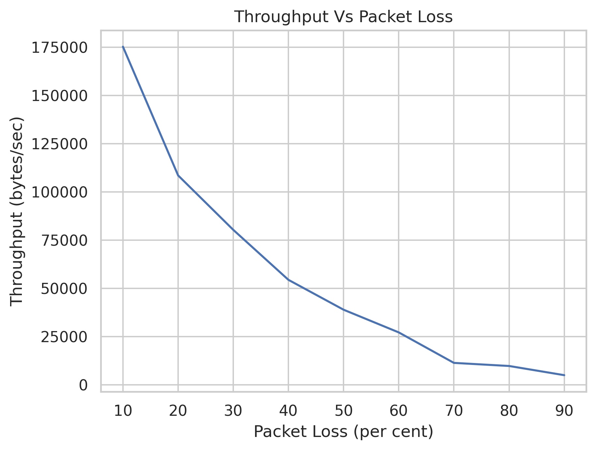

# Nirbhar UDP

A reliable file transfer protocol built on top of UDP, implementing selective repeat ARQ with sliding window protocol to ensure reliable, in-order delivery of packets over unreliable networks.

## Overview

Nirbhar UDP (Reliable UDP) is an application layer middleware protocol that provides reliable file transfer capabilities over UDP sockets. Unlike standard UDP which is connectionless and unreliable, this implementation adds reliability features including:

- **Selective Repeat ARQ**: Ensures reliable packet delivery with selective acknowledgments
- **Sliding Window Protocol**: Implements flow control with configurable window size
- **Checksum Verification**: Detects packet corruption using 32-bit hash
- **Timeout & Retransmission**: Handles packet loss with configurable timeouts
- **Connection Management**: Establishes reliable connections over UDP

## Features

- ✅ Reliable file transfer over unreliable UDP networks
- ✅ Handles packet loss, corruption, delay, and reordering
- ✅ Configurable window size, timeout, and packet size
- ✅ Progress tracking with visual progress bar
- ✅ Comprehensive error handling and recovery
- ✅ Performance monitoring and testing capabilities

## Architecture

The protocol implements three main classes:

### Packet Class
- Constructs packets with headers containing sequence numbers, ACK numbers, and checksums
- Handles payload encapsulation and integrity verification

### Sender Class
- Manages file transmission with sliding window protocol
- Implements timeout-based retransmission mechanism
- Handles ACK processing and window advancement

### Receiver Class
- Processes incoming packets with selective acknowledgment
- Manages receive buffer and in-order delivery
- Handles duplicate detection and out-of-order packets

## Installation

### Prerequisites
- Python 3.x
- `tqdm` library (for progress bar in file transfer application)

```bash
pip install tqdm
```

### Clone Repository
```bash
git clone <repository-url>
cd nirbhar-udp
```

## Usage

### Basic File Transfer

**Terminal 1 (Receiver):**
```bash
python3 ftp_receiver.py
```

**Terminal 2 (Sender):**
```bash
python3 ftp_sender.py
```

> Make sure to start the receiver first before starting the sender.

The sender will prompt for:
1. Path of the file to be sent
2. Destination path where the file should be stored on the receiver

### Protocol Configuration

Default specifications:
- **Window Size**: 1000 packets
- **Packet Size**: 798 bytes
- **Timeout**: 1 second
- **Sequence Number**: Starts from 0

## File Structure

```
├── ftp_receiver.py      # File transfer receiver application
├── ftp_sender.py        # File transfer sender application
├── graph.py            # Performance visualization utilities
├── packet.py           # Packet class implementation
├── packet_utils.py     # Packet utility functions
├── performance_test.py # Performance testing framework
├── receiver.py         # Core receiver protocol implementation
├── sender.py           # Core sender protocol implementation
└── graphs/             # Performance analysis graphs
```

## Performance Analysis

The protocol has been extensively tested under various network conditions:

### Ideal Network Conditions
- **Data Transferred**: 17.5 MB
- **Throughput**: 260.9 KB/s

### Network Impairments Testing

#### Packet Loss Performance
| Loss Rate | Throughput (KB/s) |
|-----------|-------------------|
| 10%       | 175.3            |
| 20%       | 108.6            |
| 30%       | 80.4             |
| 50%       | 39.0             |
| 90%       | 5.0              |

#### Packet Corruption Performance
| Corruption Rate | Throughput (KB/s) |
|-----------------|-------------------|
| 10%            | 174.4             |
| 20%            | 115.8             |
| 30%            | 94.5              |
| 50%            | 42.5              |
| 90%            | 4.7               |

#### Network Delay Performance
| Delay (ms) | Throughput (KB/s) |
|------------|-------------------|
| 100        | 445.5             |
| 200        | 304.8             |
| 500        | 242.2             |
| 900        | 168.8             |

#### Packet Reordering Performance
Tested with 25% packet reordering (50% correlation):

| Delay (ms) | Throughput (KB/s) |
|------------|-------------------|
| 100        | 475.3             |
| 200        | 345.6             |
| 500        | 237.8             |
| 900        | 202.0             |

### Performance Graphs

Detailed visual analysis of protocol performance under different network conditions:

#### Throughput vs Packet Loss


#### Throughput vs Packet Corruption


#### Throughput vs Network Delay


#### Throughput vs Packet Reordering


## Protocol Details

### Connection Establishment
1. Sender sends handshake packet with file metadata
2. Receiver acknowledges with expected packet count
3. Data transfer begins with sliding window protocol
4. Connection closes after final ACK

### Error Handling
- **Packet Loss**: Timeout-based retransmission
- **Packet Corruption**: Checksum verification and retransmission
- **Packet Delay**: Timeout handling with duplicate detection
- **Packet Reordering**: Sequence number-based ordering

### Flow Control
- Sliding window protocol with configurable window size
- Window size ≤ half of sequence number space
- Selective acknowledgment for out-of-order packets

## Documentation

### Detailed Reports
- **[Design Document](DesignDoc.pdf)** - Complete protocol design, architecture, and implementation details
- **[Performance Report](Performance.pdf)** - Comprehensive performance analysis under various network conditions

## Testing
```bash
python3 performance_test.py
```

## References

Kurose, J. F., & Ross, K. W. (2012). *Computer networking: A top down approach*. Boston, MA: Addison-Wesley.

## License

This project was developed as part of Computer Networks CS F303 coursework
